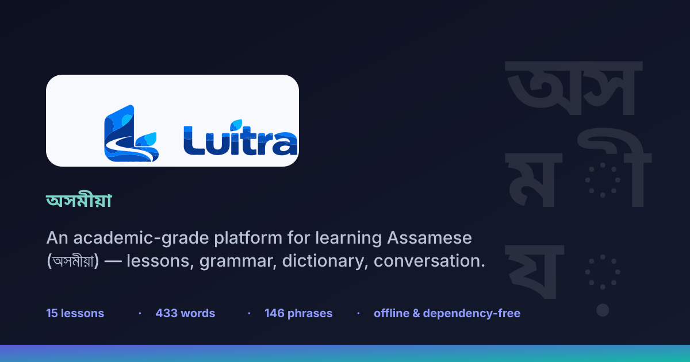
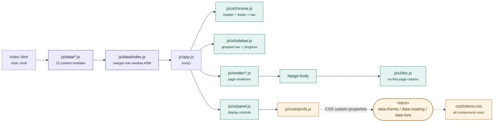
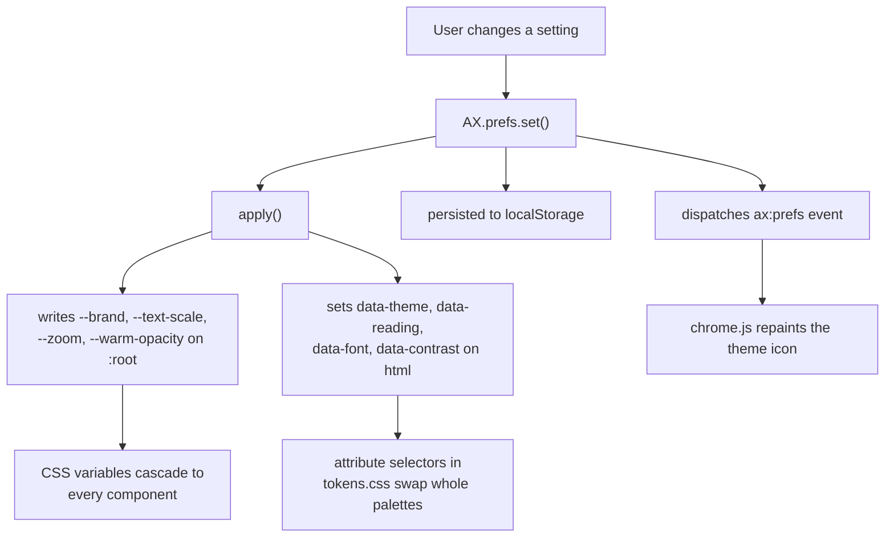

<div align="center">



# Luitra · অসমীয়া

**An academic-grade, self-contained platform for learning Assamese (অসমীয়া, Asomiya)** — the Indo-Aryan language of Assam, India.

[](CHANGELOG.md)
[](LICENSE)
[](#-design-constraints)
[](#-design-constraints)
[](#-getting-started)
[](https://apsideslabs.github.io/Luitra/)
[](.github/workflows/ci.yml)
[](assets/icons.svg)
[](CONTRIBUTING.md)
[](CONTRIBUTORS.md)

**[Open the live site →](https://apsideslabs.github.io/Luitra/)**

</div>

---

## Contents

- [What this is](#what-this-is)
- [Features](#features)
- [Architecture](#architecture)
- [Project structure](#project-structure)
- [Getting started](#getting-started)
- [Install & updates](#install--updates)
- [The display panel](#the-display-panel)
- [Content model](#content-model)
- [Design constraints](#design-constraints)
- [Accuracy statement](#accuracy-statement)
- [Accessibility](#accessibility)
- [Contributing](#contributing)
- [Security](#security)
- [Roadmap](#roadmap)
- [Licence](#licence)
- [Credits](#credits)

---

## What this is

Luitra is a complete course in Assamese that runs entirely in the browser. It is built for people who
want to actually learn the language rather than sample it: a graded curriculum, a descriptive grammar
reference, generated verb tables across the honorific tiers, the script and its sound system, a searchable
dictionary, real dialogues, spaced practice and a phrase translator.

It is deliberately **not** a web app in the usual sense. There is no server, no framework, no bundler,
no package manager and no third-party runtime dependency. The files in this repository are exactly the
files the browser executes. Clone it, open `index.html`, and it works — including offline.

> **On the name.** *Asomiya* (অসমীয়া) is the language's own name for itself, and the attested English
> romanisation used by Assamese publications. The word carries the language's signature /x/ sound,
> written শ — the sound that makes অসম become *Oxom*.

---

## Features

| Page | What it does |
| --- | --- |
| [`lessons.html`](lessons.html) | **15 lessons** across Basic · Elementary · Intermediate · Advanced, with per-lesson progress saved locally |
| [`progress.html`](progress.html) | **Progress & study record** — your XP, mastery rank, streak, saved words, a 15-rank ladder and 18 unlockable trophies, built entirely on this device |
| [`script.html`](script.html) | **Script & sounds** — the বৰ্ণমালা chart of every letter as it is read aloud (ko, kho, aa, oo …), then the vowels and consonants with a pronunciation guide for each, plus schwa deletion |
| [`grammar.html`](grammar.html) | **Grammar reference** — 19 sections: words, sentences, subject and predicate, parts of speech, word order, the case suffixes, kārak, pronouns, honorifics, gender, tense and aspect, negation, questions, plurals, compounds, suffixes, sandhi, voice and reported speech |
| [`verbs.html`](verbs.html) | **Verb tables** — the present/past/future paradigm across six persons and the three honorific tiers, plus negation, imperative and aspect |
| [`numbers.html`](numbers.html) | **Numbers & time** — the ten digits, 1–100 and the pattern above them, the ordinals, time words, the days of the week, and both the Assamese and Gregorian months |
| [`dictionary.html`](dictionary.html) | **433 words** in the Assamese script with romanisation and English, plus live search and 21 category filters (including Colours, Animals, Birds, Fruits, Vegetables, Festivals, Seasons, Shapes, One-word expressions and the full family and kinship set) |
| [`idioms.html`](idioms.html) | **Idioms & proverbs** — 22 idioms (জতুৱা ঠাঁচ) and 16 proverbs (ফকৰা-যোজনা), each with its literal image and its real meaning |
| [`phrases.html`](phrases.html) | **146 phrases** grouped by 20 settings: greetings, introductions, the market, food, travel, health, the classroom, the phone, the bank, festivals and more |
| [`conversations.html`](conversations.html) | **17 dialogues** with English, Assamese and pronunciation side by side, each with a spoken-language note |
| [`reading.html`](reading.html) | **Reading & writing** — 8 graded passages from two-line beginners' texts to short essays, each with a romanisation, an English rendering and comprehension questions, plus a guide to writing essays, letters and paragraphs |
| [`quiz.html`](quiz.html) | **Flashcards** in both directions with a running score |
| [`translator.html`](translator.html) | **English → Assamese** phrasebook lookup with a word-by-word fallback and coverage score |
| [`culture.html`](culture.html) | **Language & community** — speakers, the script and the /x/ sound, the classical-language designation, dialects and code-switching |
| [`contribute.html`](contribute.html) | **Contribute** — what you can add, why it matters, and step-by-step routes including one that needs no code |
| [`resources.html`](resources.html) | **Sources, corpora and a twelve-week study plan** |
| [`about.html`](about.html) | Contents, credits, licence and a full accuracy statement |

**Interface-wide:** white and dark themes, a comfortable reading mode, adjustable font family, text
size, page zoom, colour warmth, tint intensity, six accent palettes, high-contrast mode, a generated
on-this-page column, keyboard navigation and a print stylesheet.

---

## Architecture

Luitra is a **no-build static site**. Content is data, the interface is generated at runtime from
that data, and the visual system is four stylesheets driven by design tokens.



### How state flows



### The two rules that keep it honest

1. **Content is data, never markup.** Every lesson, word, phrase and dialogue lives in a plain object
   under `js/data/`. Adding an entry is a one-line change; no page needs touching.
2. **The interface is generated, the headings are static.** Each page carries its own `<h1>` and lede in
   HTML — good for search engines and for the CI skeleton check — while everything below is rendered
   from data.

---

## Project structure

```
Luitra/
├── index.html · lessons.html · progress.html · script.html · grammar.html
├── verbs.html · numbers.html · dictionary.html · idioms.html · phrases.html
├── conversations.html · quiz.html · translator.html
├── culture.html · resources.html · contribute.html · about.html · 404.html
│
├── css/
│   ├── tokens.css          # colour, type, space, shape, themes
│   ├── layout.css          # header, sidebar, prose column, TOC, footer
│   ├── components.css      # every component + the display panel
│   ├── motion.css          # entrance and micro-interaction timings
│   └── print.css           # print stylesheet
│
├── js/
│   ├── app.js              # boot: icons → prefs → chrome → page → TOC
│   ├── core/
│   │   ├── store.js        # localStorage + the gamified mastery engine
│   │   │                   #   (XP, 15 ranks, streaks, saved words, profile)
│   │   ├── update.js       # service worker + the update banner (PWA)
│   │   ├── install.js      # install offer, app mode, display-mode stamp
│   │   ├── prefs.js        # display preferences engine
│   │   └── icons.js        # generated icon helper (Lucide sprite, inlined)
│   ├── data/
│   │   ├── meta.js         # site metadata, facts, credits
│   │   ├── lessons.js      # 15 lessons
│   │   ├── script.js       # vowels, consonants, notes
│   │   ├── grammar.js      # grammar reference sections
│   │   ├── verbs.js        # persons, tenses, negation, imperative, aspect
│   │   ├── numbers.js      # numerals, pattern, time words
│   │   ├── dictionary.js   # 433 entries
│   │   ├── phrases.js      # 146 phrases by setting
│   │   ├── dialogues.js    # 17 conversations
│   │   ├── reading.js      # graded passages + writing guide
│   │   ├── idioms.js       # idioms (জতুৱা ঠাঁচ) and proverbs (ফকৰা-যোজনা)
│   │   ├── culture.js      # background sections
│   │   ├── resources.js    # external sources, study plan
│   │   ├── contribute.js   # contribution guide content
│   │   └── index.js        # merges everything into window.ASM
│   ├── ui/
│   │   ├── chrome.js       # navigation model, header, footer
│   │   ├── sidebar.js      # grouped navigation + progress card
│   │   ├── mobilenav.js    # mobile bottom bar
│   │   ├── panel.js        # the floating display panel
│   │   ├── toc.js          # on-this-page column with scroll spy
│   │   ├── motion.js       # scroll-reveal and stat count-up
│   └── render/
│       ├── renderers.js    # the static content pages
│       └── interactive.js  # quiz and translator
│
├── assets/
│   ├── favicon.svg · logo.svg · logo-mark.svg · icon-maskable.svg · og-cover.svg
│   ├── icon-192.png · icon-512.png · icon-maskable-512.png · apple-touch-icon.png
│   └── icons.svg           # Lucide sprite (ISC)
│
├── docs/
│   ├── ARCHITECTURE.md     # runtime design in depth
│   ├── CONTENT-GUIDE.md    # how to add content
│   ├── ACCESSIBILITY.md    # commitments and test checklist
│   ├── UPDATES.md          # install, offline and the update flow
│   └── ROADMAP.md          # what is planned and what is not
│
├── tools/
│   ├── check-links.mjs     # dependency-free internal link checker
│   └── build-sitemap.mjs   # regenerates sitemap.xml from the pages
│
├── .github/
│   ├── workflows/ci.yml    # validation + secret scanning
│   ├── ISSUE_TEMPLATE/     # bug report, feature request
│   ├── PULL_REQUEST_TEMPLATE.md
│   └── dependabot.yml
│
├── CONTRIBUTING.md · SECURITY.md · CODE_OF_CONDUCT.md
├── CHANGELOG.md · CONTRIBUTORS.md · LICENSE · README.md
├── sw.js · version.json · manifest.webmanifest
├── robots.txt · sitemap.xml · _headers
└── .nojekyll · .gitignore
```

---

## Getting started

**Open it.** Double-click `index.html`. Everything works from the file system, offline, with no install.

**Or serve it** (recommended — clipboard features behave better over HTTP):

```bash
python3 -m http.server 8000
# then open http://localhost:8000
```

**Or clone and deploy your own:**

```bash
git clone https://github.com/apsideslabs/Luitra.git
cd Luitra
# push to your own repo, then: Settings → Pages → Deploy from a branch → main / root
```

### Repo checks

```bash
node tools/check-links.mjs     # verify every internal link resolves
node tools/build-sitemap.mjs   # regenerate sitemap.xml after adding a page
node --check js/app.js         # syntax-check any file
```

CI runs all of these on every push, plus a dependency-free secret scan.

---

## Install & updates

Luitra is a **Progressive Web App**. Open the live site and install it like an app:

| Platform | How to install |
| --- | --- |
| Android / Chrome | An **Install app** prompt, or ⋮ → *Add to Home screen* |
| Desktop Chrome / Edge | An **install** icon in the address bar |
| iPhone / iPad (Safari) | **Share → Add to Home Screen** |

Installed, it opens full-screen, works **offline** (a service worker caches the whole app), and shows an **update notice** when a new release is deployed. A small **Updates** button at the bottom-left checks on demand and reports *“You're up to date”*, *“Update available”*, or a friendly offline message.

The notice appears **only in the installed app** — never on the plain website. It can detect three things: a waiting service worker, a newer `version.json`, and the newest GitHub release. Full detail, including how to test it locally, is in [`docs/UPDATES.md`](docs/UPDATES.md).

### Two feels from one codebase

The website and the installed app are the **same repository, the same files, the same build**. The browser simply tells the page which one it is running as, and the shell adapts.

| | On the website | In the installed app |
| --- | --- | --- |
| Header | brand + *অসমীয়া · Assamese Learning Platform* | a compact app bar with an **App** badge and *Installed app · works offline*, honouring the device's safe-area inset |
| Footer | identity, link columns, accuracy note, and an **install** offer | identity and the accuracy note; the link columns are dropped, because the app navigates from its own nav |
| Feel | ordinary web scrolling | no pull-to-refresh bounce, no tap highlight |
| First run | — | a one-time note confirming the app lives on the device and works offline |

Nothing about the content changes: every page, every word and the whole offline behaviour are identical in both. Only the shell differs. The detection lives in `js/core/install.js`, which stamps `data-display="standalone"` (or `"browser"`) on `<html>` before the header is built; the styling is one guarded block in `css/components.css`.

---

## Gamification

The platform is a **language studio**, not a static reader. Everything below is computed on the
device and stored in `localStorage` — there is no account and nothing is uploaded.

- **XP.** Each completed lesson is worth 50 XP; the Quiz Arena adds bonus XP and tracks your best
  streak. The figure appears as a live pill in the header on every page.
- **15 ranks**, from *Initiate* to *Assam Laureate*, each with its own XP threshold, a focus line and
  the milestone that unlocks it. The ladder is drawn on the Progress page and in the sidebar card.
- **18 trophies** — lesson tiers, XP clubs, streak milestones and vocabulary goals — shown as a grid
  on the Progress page with an earned / locked state.
- **Saved words.** Every dictionary row carries a star; starred words are collected on the Progress
  page and can be filtered in the Dictionary.
- **A learner profile** with an editable name, and **export / import of the whole study record** as
  JSON, so progress survives a cleared browser.
- The rank and trophy definitions live in `js/core/store.js` and the Progress renderer; the
  content is Assamese and the rank titles are English.

## The display panel

The round **Aa** button in the bottom-right corner opens the display panel. Every control writes a CSS
custom property or a `data-` attribute on `<html>`, so the whole interface reacts without any
per-component JavaScript.

| Control | Range | How it is applied |
| --- | --- | --- |
| Theme | White · Dark · Auto | `data-theme` swaps the entire token set |
| Reading mode | Off · Comfortable | Paper-toned palette, serif, wider leading |
| Font | Sans · Serif · Mono | `data-font` reassigns `--font` |
| Text size | 85 – 150 % | Root `font-size: calc(16px * var(--text-scale))` |
| Page zoom | 80 – 140 % | `zoom` on `body` |
| Warmth | −100 (cool) … +100 (warm) | A tint overlay's colour |
| Tint intensity | 0 – 100 | The overlay's opacity |
| Accent colour | 6 palettes | Rewrites `--brand`, `--brand-ink`, `--brand-soft` |
| Contrast | Normal · High | `data-contrast` strengthens borders and text |
| On-this-page column | Show · Hide | Rebuilds the right-hand TOC |

Preferences persist in `localStorage` under `luitra.prefs`. **White is the default theme.**

---

## Content model

All content lives in `js/data/`. The shapes are small and documented in full in
[`docs/CONTENT-GUIDE.md`](docs/CONTENT-GUIDE.md).

```js
// a dictionary entry
{ en: "water", bo: "পানী", rom: "pani", cat: "Food & drink" }

// a phrase
{ en: "Thank you", bo: "ধন্যবাদ", rom: "dhonyobad", cat: "Greetings & courtesy" }

// a lesson
{ level: "Basic", n: 1, title: "What is Assamese?", summary: "…", body: "<p>…</p>" }
```

**Two invariants, enforced by review:**

1. Every Assamese string is written in the **Assamese script**.
2. Every Assamese string carries a **romanisation**, because the script does not show every sound
   unambiguously and learners need both.

The romanisation scheme is the one standard in Assamese lexicography, and it is used everywhere in the
project without exception: **`x`** for শ / ষ / স, **`w`** for ৱ, **`r`** for ৰ, and **`y`** for য় — so
অসমীয়া is *Oxomiya*, and অসম is *Oxom*.

---

## Design constraints

These are deliberate and load-bearing. Features that break them are out of scope.

| Constraint | Consequence |
| --- | --- |
| **No build step** | `.html`, `.css` and `.js` are served verbatim. Editing a file and pushing *is* the release. |
| **No runtime dependencies** | No npm, no CDN, no web fonts fetched at runtime. Icons are inlined; typefaces resolve from system fonts. |
| **Works offline** | Everything functions from `file://` or with the network unplugged. Once installed, a service worker caches the whole app. |
| **Installable** | A Progressive Web App: installable to a home screen, with an in-app update notice — see [`docs/UPDATES.md`](docs/UPDATES.md). |
| **No tracking** | No analytics, no telemetry, no cookies. The only stored state is your display preferences, lesson progress and update dismissals, in your own browser. The installed app makes two network requests for the update check — a same-origin `version.json` and GitHub's public releases API; nothing else leaves the page. |
| **No accounts** | A static site cannot authenticate anyone, so it does not pretend to. |
| **Accessible by default** | Semantic headings, visible focus, WCAG AA contrast, keyboard operation — see [`docs/ACCESSIBILITY.md`](docs/ACCESSIBILITY.md). |

---

## Accuracy statement

> **Read this before trusting anything in the platform.**

Assamese is a well-documented language, but it has **several regional varieties** — Eastern/Standard,
Kamrupi and Goalpariya differ in real ways — and this project describes the Standard (Eastern) variety
unless a note says otherwise. It was compiled from public learner resources and published descriptions of
Assamese grammar. It was **not** produced by, or verified with, a native speaker.

Where sources disagreed, the more widely repeated form was kept, and uncertain items are flagged **in
place** rather than smoothed over. The verb tables are generated from the regular ending patterns and
model the system rather than asserting that every derived form is attested for every verb; Assamese has
irregular verbs, and the intimate (*toi*) paradigm is not fully standardised in written sources.

Treat Luitra as a **learning scaffold**. Confirm details with speakers, and if you are a speaker,
please [open an issue](https://github.com/apsideslabs/Luitra/issues/new?template=bug_report.md) —
corrections from the community are the single most valuable contribution to this project.

---

## Accessibility

Semantic heading order (one `h1`, no skipped levels), a skip link, visible focus rings, ARIA on the
display panel (`role="dialog"`, `aria-pressed`, `aria-expanded`), WCAG 2.1 AA contrast targets, a
minimum text size of 1rem, `prefers-reduced-motion` support, full keyboard operation and a print
stylesheet. The manual test checklist is in [`docs/ACCESSIBILITY.md`](docs/ACCESSIBILITY.md).

---

## Contributing

Contributions are welcome — especially content corrections from Assamese speakers and teachers. Please read
[`CONTRIBUTING.md`](CONTRIBUTING.md) and [`docs/CONTENT-GUIDE.md`](docs/CONTENT-GUIDE.md) first.

The short version: run `node tools/check-links.mjs` before opening a pull request, keep every Assamese
string in the Assamese script **with** a romanisation, add no emoji (the project uses the Lucide sprite),
and do not invent Assamese forms — flag uncertainty instead.

---

## Security

This is a static site with no server, no user accounts, no data collection and no third-party scripts.
The threat model, the controls that apply, and how to report a problem are in
[`SECURITY.md`](SECURITY.md). The repository has GitHub **secret scanning** and **push protection**
enabled, and CI runs a dependency-free secret scan on every push.

---

## Roadmap

Planned: audio pronunciation, spaced-repetition review, an offline service worker, and growing the
dictionary towards 300 entries. Explicitly **not** planned: ads, tracking, telemetry, accounts, CDNs
and a build step. Full detail in [`docs/ROADMAP.md`](docs/ROADMAP.md).

---

## Licence

[MIT](LICENSE) © 2026 The Study Cipher.

---

## Credits

| Component | Attribution |
| --- | --- |
| Icons | [Lucide](https://lucide.dev) v1.49.0 — ISC Licence, bundled as an inline SVG sprite |
| Typefaces | Inter and Noto Sans Bengali, referenced by name and resolved from system fonts |
| Language data | Compiled from public learner resources and published Assamese linguistics — see [`resources.html`](resources.html) and [`about.html`](about.html) |

<div align="center">
<sub>Built as a study resource. <strong>অসমীয়া শিকোঁ আহক</strong> — let us learn Assamese.</sub>
</div>
